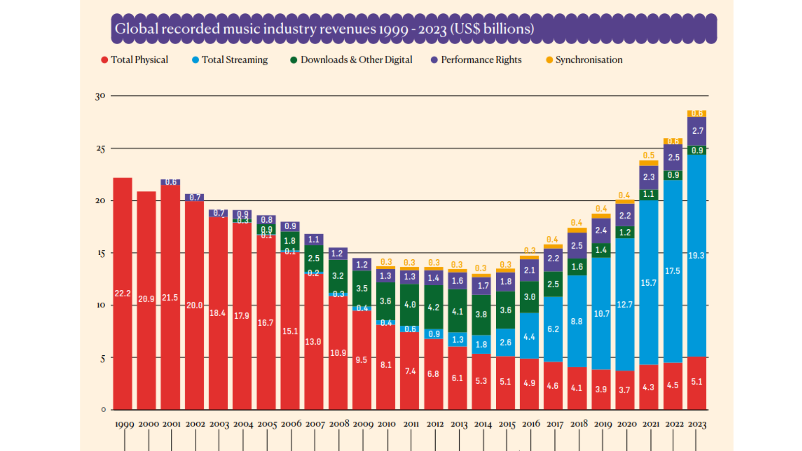
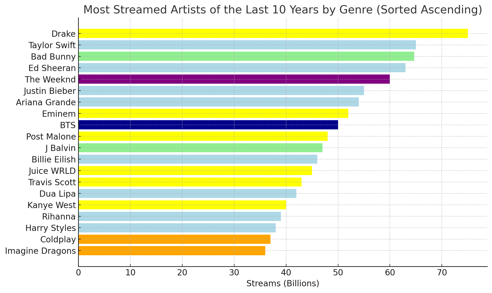
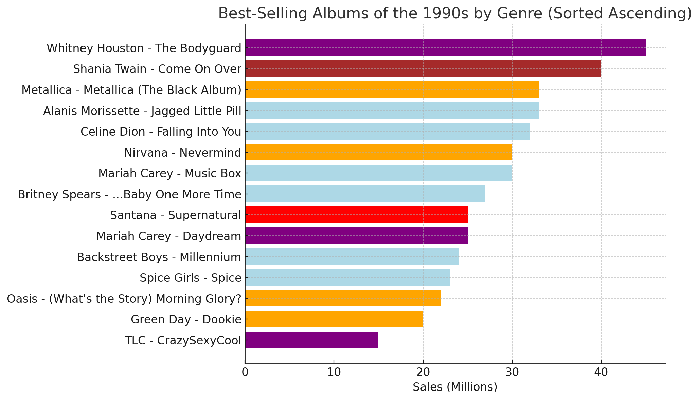
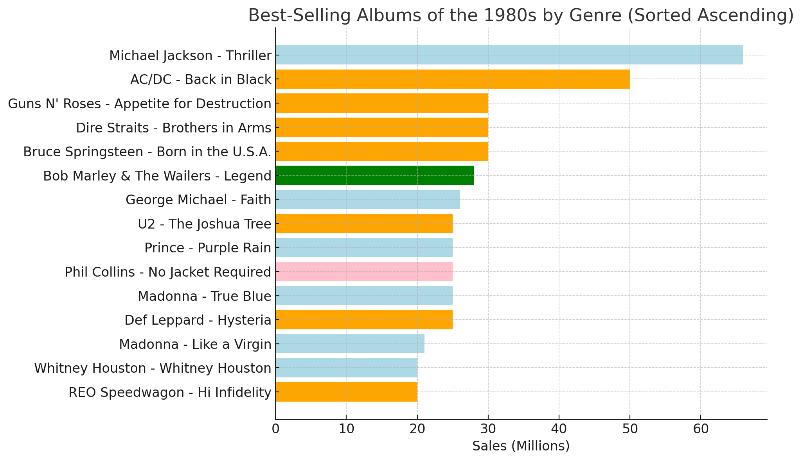
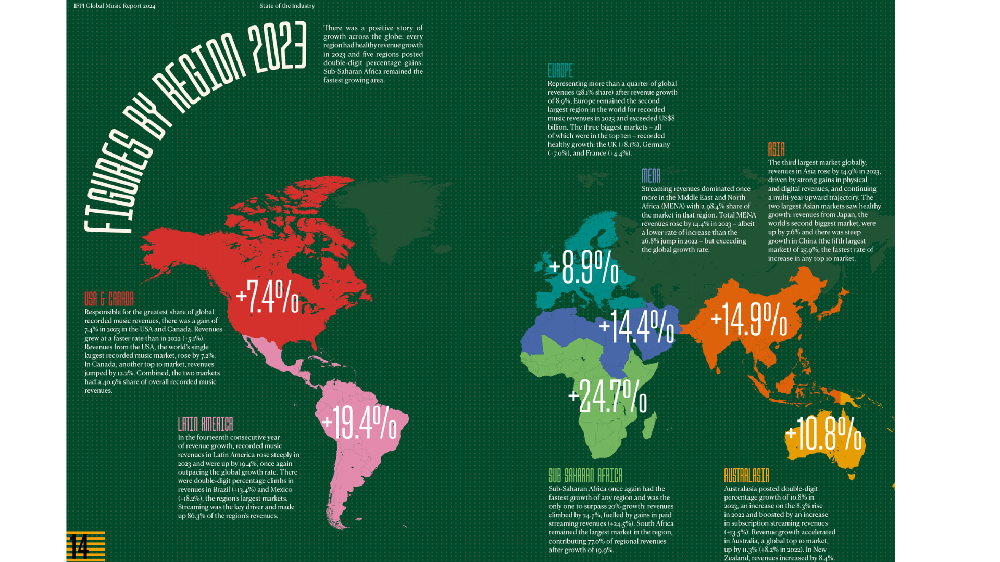
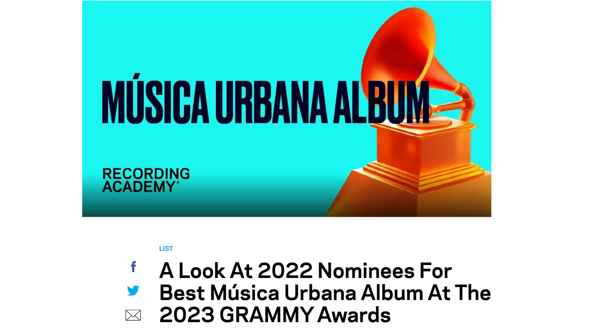
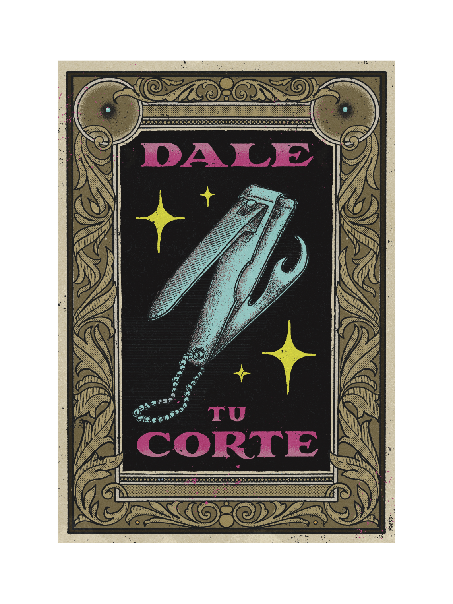
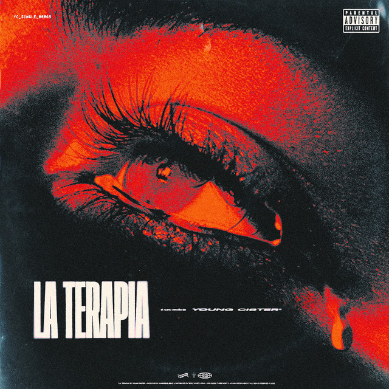

---
title: "Introducción: ¿Por qué es importante la Música Urbana? ¿Cómo problematizarla?: Una visión desde las ciencias sociales y la musicología"
author: "Grupo Música Urbana CMUS - Sebastián Muñoz"
output:
  xaringan::moon_reader:
    css: xaringan-themer.css
    nature:
      slideNumberFormat: "%current%"
      highlightStyle: github
      highlightLines: true
      ratio: 16:9
      countIncrementalSlides: true
      font-family: "Outfit, Arial, sans-serif"
---


```{r xaringan-themer, include=FALSE, warning=FALSE}

#install.packages("pacman")
pacman::p_load(xaringan,xaringanthemer,tidyverse, gt,kableExtra, xaringanExtra )


style_duo_accent_inverse(
  primary_color = "#FFFFFF",
  secondary_color = "#808080",
  inverse_header_color = "#A8FBC8"
)


```


```{r xaringan-animate-css, echo=FALSE}
xaringanExtra::use_animate_css()
xaringanExtra::use_tachyons()
xaringanExtra::use_share_again()

```


```{r xaringan-logo, echo=FALSE}
xaringanExtra::use_logo(
  image_url = "https://raw.githubusercontent.com/rstudio/hex-stickers/master/PNG/xaringan.png"
)
```


class:   inverse, middle, slideInRight, fadeOutLeft

# Índice

1. ¿Por qué es importante la Música Urbana?
2. ¿Cómo problematizar la Música Urbana?


---

class:   middle, slideInRight, inverse fadeOutLeft
background-image: url("img/2.png")
background-size: cover

# 1. ¿Por qué es importante la Música Urbana?

---
background-image: url("img/money.gif")
background-size: cover
class:   middle, center


## 1.1. Económica y comercialmente


---

class:   inverse, middle, slideInRight, fadeOutLeft
### Spotifización de la música



---
class:   middle, center,  middle, slideInRight, fadeOutLeft

### De América Latina, lidera este cambio la "Música Urbana"





---
class:   middle, center, inverse

### ¿Qué pasaba en la década de 1990 con los albumes más vendidos?




---

class:   middle, center, middle, slideInRight, fadeOutLeft

### ¿y en los 80?





---
class:   middle, center, middle, slideInRight, fadeOutLeft

### La música latina presenta un crecimiento sostenido en plataformas digitales (IFPI).



---

class:   middle, center, inverse

### Reconocimiento de la gran Industria 



---
class:   middle, center
### La música chilena es la más escuchada en Chile.

]

---


background-image: url("img/nadiequiereser.jpg")
background-size: cover

class:  bottom, center


## Se crea un mercado!
- ¿Cómo se relaciona la autogestión y los home-studios con las plataformas y los sellos?
- ¿Quiénes están detrás de estos números?
- ¿Cómo son los patrones de consumo?
- Disclaimer: distinto streaming que shows en vivo


---

background-image: url("img/3.png")
background-size: cover

.pull-left[
### Capitalismo de plataformas y Música urbana en América Latina 
  - La mezcla entre la autogestión y los home-studios con las grandes compañías. 
  - Nuevas Alianzas con el sector de las industrias culturales.
  - Estado ausente 
]

.pull-right[
]


---

background-image: url("img/Musica-urbana_01Port.gif")
background-size: cover

class:   middle, center 

## 1.2. Socialmente

---

background-image: url("img/dy.gif")
background-size: cover

class:   middle

.pull-left[
## ¿Qué hace y dice la Música Urbana sobre la relación entre las dinámicas globales y locales?
- ¿Cómo se apropia en Chile y latinoamérica un concepto de circulación internacional?
- ¿Qué es lo "latino" en la Música Urbana?: predominancia del español.]


---
class: inverse

## Música Urbana no es *Urban Music* ni *Musique Urbaine*

.pull-left[
- USA: Eufemización de cuestiones de Raza (negro) e importancia de radiodifusión: black music: 
*«Estoy mitad y mitad», dijo. «Por un lado, estoy muy agradecido de que lo que he hecho pueda ser reconocido en un mundo como éste, pero también apesta que siempre que nosotros, y me refiero a tipos que se parecen a mí, hacemos algo que rompe géneros o que es cualquier cosa, siempre lo ponen en una categoría rapera, urbana».*

- Francia: Eufemización de cuestiones de Raza (no-blanco: negro, arabe) e importancia de políticas públicas ]

.pull-left[
]

]


---

background-image: url("img/crisflow.png")
background-size: cover

class:   middle, center 

## ¿Hay otra América Latina fuera de Miami?

- ¿Cómo es la música urbana de "extremo sur"?


---

class:   middle, center 

### 1.2.1. Nuevas generaciones

.pull-left[
### ¿Es solo una moda?
### ¿Representa/produce a una generación?
### Jóvenes inmersos en nuevas tecnologías.
#### Mayor preocupación económica y ambición de ascenso social, liberalismo sexual
####  "Darle el corte": **Individualismo o nuevas formas de entender la relación entre individuo y colectivo**]

.pull-right[
]
---

class:   middle 
background-image: url("img/jordan23.gif")
background-size: cover

.pull-left[
### 1.2.2. Sectores populares

- "Soy flaite con orgullo": ¿Qué dice esta figura?
- Ascenso social y el ideal de "la casa para la mamá."
- La música como alternativa de vida.
- Vínculos (o no) con la delincuencia.
- ¿Qué pasa con la política?]

---

class:   middle 
background-image: url("img/pablozowie.gif")
background-size: cover

.pull-left[
### 1.2.3. Identidades de género y relaciones sexo-afectivas

- "Ya no creo en el amor."

- Relación reivindicación de la figura de la "puta."]

---
class:   middle

background-image: url("img/legustanflaites.gif")
background-size: cover

.pull-left[
### Amor entre clases 

*Y a ella le gustan los flaites
Con corte elegante
Que la lleven pa' Europa
Y que le compren diamantes

Sus padres son cuicos viven en Las Condes
No dejan que baje pa' la población
No quieren que se enamore de un asaltante
Pero yo me la robo a lo matón
Y tus padres no me quieren
No me quieren ver contigo
Porque dicen que soy flaitе
Y que tengo enеmigos*]


---

class:   middle, center, inverse, middle, slideInRight, fadeOutLeft

.pull-left[
### 1.2.4. Salud mental

#### Sentimientos de soledad.
#### El deseo de éxito.
#### Ascensos meteóricos y las dificultades para lidiar con la fama y la envidia.]

.pull-right[
]

---

class:   bottom

background-image: url("img/trump.jpg")
background-size: cover


.pull-left[
### 1.2.5. Política

#### Cantantes de reggaetón apoyando públicamente a Donald Trump.
#### Chili Parker y Papo en Argentina afines a Milei.]


---
class: bottom 
background-image: url("img/lizz.png")
background-size: cover

## ¿Ethos Nihilista? ¿Ethos anárquico? ¿Individualismo? ¿Individualismo grupalista?

.pull-left[
- *el sueño colectivo es la familia, los amigos. Es que si no hay opciones, ¿qué hace la gente? Bueno, dicen ‘voy a traficar droga, qué es lo que hacen todos, pero la voy a hacer mejor, no voy a alumbrarme, no voy a consumir, voy a juntar la plata y me voy a comprar un auto y después voy a hacer otro negocio mejor, invertir en algo tranquilo, legal y así salir adelante’. Los chilenos no somos tontos, somos inteligentes. El tema es que no existen las oportunidades para desarrollar esa inteligencia en un aspecto más de ‘conducto regular’, cotidiano, normal.*
## Dj Lizz]


---
class: bottom

background-image: url("img/Matias-toledo.jpeg")
background-size: cover

.pull-left[
#### Matías Toledo, cercano a Pablo Chill-E, reivindica a la izquierda: "*Militar la contradicción*"
#### Conflicto entre rap y trap: la supuesta superioridad moral del rapero chileno frente al trap, percibido como "apolítico."]


---
background-image: url("img/magic.png")
background-size: cover

class:   center, bottom, inverse

.pull-right[
## 1.3. Artística y musicalmente]

---


background-image: url("img/fruty.jpg")
background-size: cover

.pull-right[
#### Nuevas formas musicales que se crean o recrean.
#### Relación con los softwares y la producción en home-studios.
#### Importancia del "sonido": beatmaker + ingenieros/técnicos en sonido
#### Mezcla de rapeo, canto y autotune
#### ¿Qué innovaciones musicales aporta esta forma de creación?
#### ¿Cómo se aprende? ¿Cómo se mejora? ¿Cuáles son las dinámicas creativas entre las personas?.]


---
class: inverse
background-image: url("img/paloma.png")
background-size: contain
## 1.3.1 ¿Qué pasa en con la experiencia en vivo?


---

background-image: url("img/ultrasolo.gif")
background-size: cover
## 1.3.2 Importancia del videoclip (vs. Album)


---
class: bottom
background-image: url("img/fondart.png")
background-size: contain

## 1.4. Políticas públicas y Estado


---

class: center, bottom
background-image: url("img/3.png")
background-size: cover
.pull-left[
#### ¿Cuál es el rol del Estado?
#### ¿Llega tarde a las transformaciones en la música y los gustos?
#### ¿Qué políticas podrían implementarse para promover esta música?
#### ¿En qué medida se puede potenciar la alternativa a la delincuencia?
]

.pull-right[ 


]

---
class:   middle, center, inverse, middle, slideInRight, fadeOutLeft
# 2. ¿Cómo problematizar la Música Urbana?

---
background-image: url("img/3.png")
background-size: cover
class:   middle
- No asumir previamente una definición fija: definición problemática de los géneros musicales.
- Evitar dicotomías y preferir articulaciones:
  - Populismo vs. miserabilismo (Grignon & Passeron)
  - Sociologismo vs. esteticismo (Hennion)
  - Apropiacionismo vs. imitacionismo 
  - Emergentismo vs. Anacronismo
- La Música Urbana como un objeto de estudio que importa y merece ser tratado seriamente.


---
class:   middle, inverse, middle, slideInRight, fadeOutLeft
# 3. Propuesta: La Música Urbana como un dispositivo para entender la subjetividad de las nuevas generaciones y la crisis
- tesis del malestar y las desigualdades (Mayol, Atria): hay un malestar ante desigualdades económicas y de poder. 
- tesis de las expectativas (Carlos Peña): más que malestar hay aumento de expectativas en sociedad que ha mejorado significativamente en términos económicos y educativos: "ambiciosos y mal agradecidos"
- tesis de las tensiones experiencias, ideales normativos y cambios metariales (Kathya Araujo): 
  - transformaciones socio-económicas y culturales, emergencia de lógicas contradictorias 
  - democratización de relaciones sociales + continuidad de desigualdades (económicas, poder) + hiper-individuos que se afirman a sí mismos, pero también sobre-exigidos. 

---

background-image: url("img/chile.png")
background-size: cover

class:   bottom, slideInRight, fadeOutLeft
## ¿Qué aporta Música Urbana?
  - relación con sonidos/imágenes/estéticas/cuerpos y objetos (tecnologías): no sólo discursos
  - importancia de la presentación personal: Yo situado y dramatizardo
  - entramado de relaciones "contradictorias": generación de salidas!
  - vínculos entre autonomía y las industrias culturales 
  - pensar la producción de subjetividad de manera compleja y holística, un conjunto de mediaciones (A. Hennion)


---
class:   middle, center,  middle, slideInRight, fadeOutLeft
# 4. Para la próxima sesión!